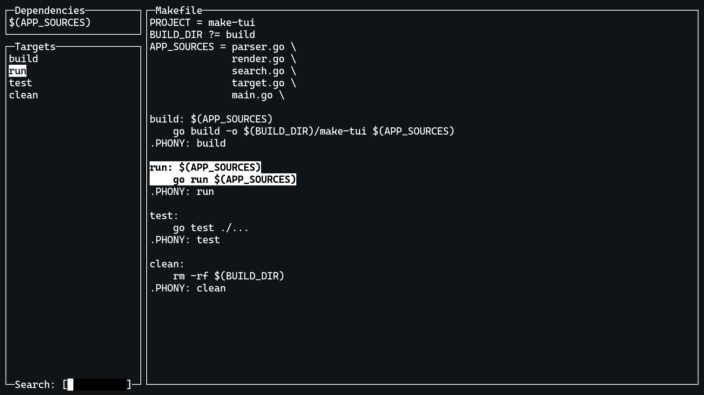

# make-tui

`make-tui` is an application to display and run Makefile rules in the terminal.

## Installation

    $ go get github.com/claby2/make-tui

## Usage

    Usage of make-tui:
      -a	Display all targets including special built-in targets
      -f string
            Parse given file as Makefile
      -h	Print this message and exit
